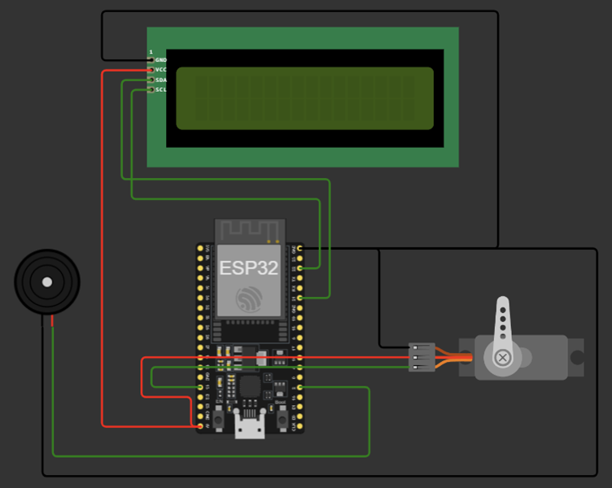

# Water Waker (Introduction)

Water Waker is an alarm clock supplemented with a water spraying function to help wake up users. Taking inspiration from the refreshing sensation of splashing water on one's face in the morning, the Water Waker will spray the user's face with a brisk burst of water when the alarm goes off.

# Hardware Design and Implementation Details

The product consists of ESP32 as computing device, a water pump attached to servo as electro-mechanical properties, mini water tank, LCD 1602a as a time indicator and buzzer/beeper as audio device. 

As visualized in the schematic/wiring diagram above, our prototype uses four signal pins, and two power pins. Pin D2 is connected to a buzzer to trigger it when the event occurs. Pin D21 and D22, works as medium to transmit SDA (Serial Data) and SCL (Serial Clock), respectively, in an I2C communication between ESP32 and 1602a LCD. Last, Pin D13 works to transmit PWM signal to the servo, so that servo can pull the spray trigger.

# Network Infrastructure

As for network infrastructure, our product has ESP32, Blynk platform and user's smartphone. Both ESP32 and smartphone acts as a client, means that those device are either actively sending request or receiving data from another client. On the other hand, Blynk platform acts as a server. It manages the communication between the ESP32 and the smartphone app, processes incoming data, and sends commands or updates to the ESP32.

# Software Implementation details

# Test Result and Prformance Evaluation

# Conclusion and future work

The “Water Waker” project was created to help solve the issue of sleeping too much, a problem that’s common among college students. The goal was to make an alarm that wakes people up by spraying water. The project showed how IoT can be used in everyday life, changing the way we wake up in the morning.

However, there is, still, a room for improvement. Several potential improvements and future work can be considered for the Water Waker project, such as increasing water capacity, improving battery life and customizable alarm settings.
